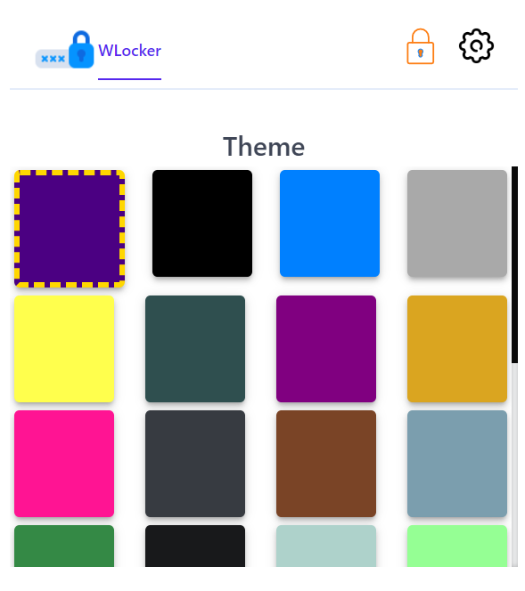
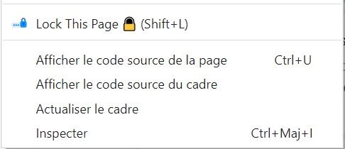
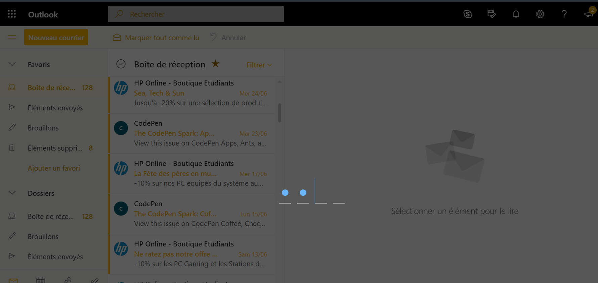
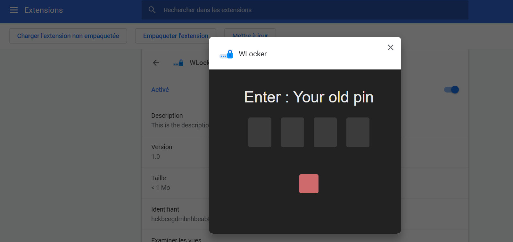

# WLocker
Simple web extension wo allow to lock any website with pin code

##Youtube 
[Youtube video](https://www.youtube.com/watch?v=swLp7gdQPGc)

#Popup

#ContextMenu

#LockPage

#Pin Setting
Default Pin : 1234
